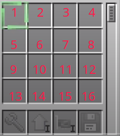
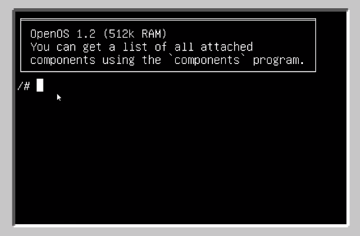

# Comandos-Basicos-Robots-OpenComputers
Uma pequena lista com os comandos básicos dos Robots do OpenComputers Minecraft mod

Confira a documentação oficial em: https://ocdoc.cil.li/

---------
# Informações importantes:

**Numeração do inventário do Robot:**

obs: Utilizando [Inventory Upgrades](https://ocdoc.cil.li/item:inventory_upgrade) o inventário pode passar a ter mais slots

**Bateria do Robot:**

obs: Utilizando [Battery Upgrade](https://ocdoc.cil.li/item:battery_upgrade) a bateria pode ser aumentada

**Terminal do Robot:**
Aqui onde você executará os comandos e utilizará o robô

**Editor:**
O editor do OpenComputers é o **edit**, utilize **edit** seguido do nome do arquivo que deseja criar ou editar e receba o editor aberto para modificações (Ex: edit teste.lua | edit texto.txt)

obs:
- Para salvar uma modificação no **edit** utilize: **Ctrl+S**
- E para sair do **edit** utilize: **Ctrl+W**

-------
# Lua:

**Interoretador:**
Para chamar o interpretador Lua utilize "**lua**" no terminal
Para executar um programa Lua utilize "**lua**" seguido do nome_do_programa.lua (Ex: lua teste.lua)

**Documentação Lua:**
[Lua 5.2 - Documentação Português](https://www.lua.org/manual/5.2/pt/)
[Lua 5.4 - Documentation English](https://www.lua.org/manual/5.4/)

--------
# Comandos Robots:

|        Comando        | Explicação                                                                     | Observação                                                                                                                                        |
|:---------------------:|--------------------------------------------------------------------------------|---------------------------------------------------------------------------------------------------------------------------------------------------|
| robot.swing(n)        | Quebra o bloco (função do mouse esquerdo)                                      | "n" sendo o número de vezes que o comando será executado   Caso não haja parâmetro o comando será execuldado uma vez                                |
| robot.use()           | Usa o que estiver em sua mão ou um bloco interativo (função do mouse esquerdo) |                                                                                                                                                   |
| robot.select(n)       | Seleciona um dos slots do inventário demarcando-o                              | "n" sendo o número do slot                                                                                                                        |
| robot.place**LADO**() | Usa o item que está demarcado no inventário                                    | Troque **LADO** por right/left/up/down   Caso não haja **LADO** o intem será usando à frente                                                        |
| robot.drop**LADO**()  | "Dropa" o item demarcado no inventário para outro inventário (baús, fornálias) ou para o chão   *Pode necessitar de um [Inventory Controller Upgrade](https://ocdoc.cil.li/item:inventory_controller_upgrade)                                       | Troque **LADO** por right/left/up/down   Caso não haja **LADO** o intem será dropado no inventário à frente                                         |
| robot.suck**LADO**()  | Retira um item do inventário no **LADO** para o seu lugar demarcado   *Pode necessitar de um [Inventory Controller Upgrade](https://ocdoc.cil.li/item:inventory_controller_upgrade)           | Troque **LADO** por right/left/up/down   Caso não haja **LADO** o inventário padrão será à frente                                                   |
| robot.turn**LADO**(n) | Manda o lado que o robô deve olhar                                             | Troque **LADO** por right/left "n" sendo o número de vezes que o comando será executado   Caso não haja parâmetro o comando será execuldado uma vez |
| robot.**LADO**(n)     | Manda o robô subir ou descer                                                   | Troque **LADO** por up/down "n" sendo o número de vezes que o comando será executado   Caso não haja parâmetro o comando será execuldado uma vez    |
| robot.forward(n)      | Manda o robô andar um bloco para frente n vezes                                | "n" sendo o número de vezes que o comando será executado   Caso não haja parâmetro o comando será execuldado uma vez                                |